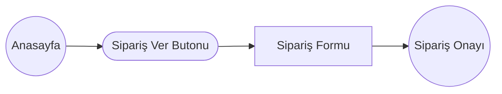
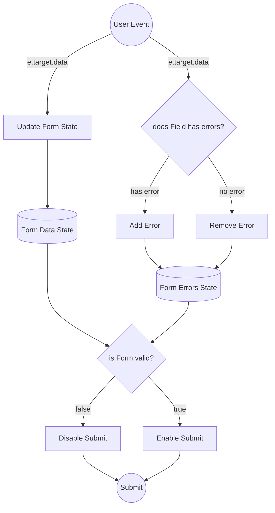

# Sprint Challenge: _Teknolojik Yemekler - SPA_

## Proje Açıklaması

Bu Single Page Application (SPA) projesi, geçmiş sprint boyunca öğrenilen kavramları ve teknikleri uygulamana ve bunları somut bir projede kullanmanı sağlayacak. Bu sprintte **tek sayfa uygulamalarını** (SPA) keşfettin. Sprint boyunca, **routing, formlar, ve cypress testlerini** öğrendin. Challenge skorun, bu sprint boyunca işlenen materyali kullanarak bağımsız çalışma yapabilme yeteneğinin bir göstergesi olacak. Bu projeyi de ödevlerdeki gibi tek başına yapacaksın.

S8 içinde de Workintech eğitmenlerine, adeta bir teknik mülakattaymış gibi, bu projeyi sunmanı istiyoruz.

- Bu sunumda, _1 dk_ içerisinde, CSS'e döktüğün arayüz; 3dk içinde geliştirdiğin React veri akışını anlatacaksın. İlk önce arayüzde nasıl bir kullanıcı deneyimi sunduğunu kısaca özetleyip, sonra altta kodların nasıl çalıştığını, nasıl bir veri akışı kurduğunu, açık bir şekilde ifade edebilmelisin.

> Kısaca: 4 dk içinde, önce arayüzü anlatıp, sonra kodun nasıl
> çalıştığını ifade edebilmelisin. Zaman kullanımı ve sunum tekniğin de değerlendirme kriterlerinde yer alıyor. Öncesinde, kendini videoya çekerek, sunum pratiği yapabilirsin.

## Önemli Notlar

- Her aşamada, tasarımı birebir uygulamaya çalışmalısın. Mobil versiyonu için Figma'ya bakabilirsin.
- Önce İterasyon 1'i tamamlayıp, sonra İterasyon 2'ye geçmelisin. Proje akışı minimum zamanda, React bilgini pekiştirebilmen için tasarlandı. Plandan çıktıkça asıl önemli olan işten uzaklaşıyor olabilirsin. O yüzden ek bir şey yapma isteği gelirse not alıp, proje bitince dönmelisin.
- Görevleri yetiştirmek için, MUTLAKA tasarımların listelendiği sırayla ilerle. Proje planından şaşma. Önceki task yetişmeden sonrakine geçtiysen ve eksik kalırsa puanın kırılabilir.
- Metinler ve form alanı başlıklarını kendi istediğin gibi güncelleyebilirsin. Yine de kesinlikle **renkler ve yerleşimde** değişiklik istemiyoruz.
- Sunumdan sonra dilersen sonrasında kendi portföyüne eklemeden önce için özelleştirebilirsin.
- (IT2) Sayfalar arası veri taşırken, (sipariş formundan, sonuş sayfasına), router veya başka bir global state management aracı kullanmadan, sadece [Prop-Lifting](https://react.dev/learn/sharing-state-between-components) tekniğiyle, projenizi geliştirmenizi bekliyoruz.

Not\* Bu dökümanın en sonunda da, sunumda seni değerlendireceğimiz başlıkları da bulabilirsin.

### Temsili Veri Akış Diagramları

#### Routes



#### Sipariş Formu Veri Akışı



## Talimatlar

Bu sprint challenge'ında, bilgisayar başında karnı acıkan yazılımcılara yiyecek getirmek için tasarlanmış bir web sitesi **Teknolojik Yemekler**' markasına, _Anasayfa_, _Sipariş Formu_ ve _Sipariş Alındı_ sayfası oluşturarak bu konulardaki ustalığınızı göstereceksin.  
Proje iki zorluk aşamalı,

1.  **İterasyon 1**: ilk önce asgari yeterli ürün (IT1-Minimum Viable Product) aşamasına getirmeyi hedeflemelisin.
2.  **Iterasyon 2**: İleri düzey görevlere eadece ama sadece, tasarımdaki IT1 kilometre taşına geldikten sonra başlamalısın. Buradaki gelişmiş görsel ve teknik problemleri çözmeyi IT1 sonrasında, aşağıda belirtilen sırada çözerek ilerlemelisin.
3.  Projenin iki aşamasının da gerekli görselleri proje klasöründe var. Ayrıca [**Figma Formatında**](https://www.figma.com/design/q0xPW5uCel3rdzFgpjR9lt/S8-Pizza-React-Challange-v2.1) formatındaki tasarıma bu adresten erişebilirsiniz.

## 🚀 Live Demo
Check out the live application here: [**https://order-pizza-dun.vercel.app/**](https://order-pizza-dun.vercel.app/)

## ✨ Key Features

### 📱 Responsive & Mobile-First Design
*   **Fully Responsive:** Developed with a mobile-first approach using **Tailwind CSS**, ensuring perfect layout transitions from mobile to desktop.
*   **Figma Fidelity:** Strictly adhered to the provided [Figma Design](https://www.figma.com/design/q0xPW5uCel3rdzFgpjR9lt/S8-Pizza-React-Challange-v2.1) for colors (#FDC913, #CE2829), typography, and spatial arrangements.

### 🛠 Dynamic Form Management
*   **Real-time Validation:** Order button is disabled until all criteria are met (Min 3 characters for name, 4-10 toppings selected).
*   **Controlled Components:** All form fields (Radio, Checkbox, Textarea, Dropdown) are managed via React state.
*   **Data Flow:** Implemented **Prop-Lifting** to transfer complex order data from the form to the Success Page.

### 🧪 Automated Testing (QA)
Comprehensive End-to-End (E2E) testing suite implemented with **Cypress**:
*   [x] **Input Validation:** Verification of user name character length.
*   [x] **Interactive Elements:** Testing multiple topping selections and their constraints.
*   [x] **Full Flow:** Simulating a complete order process from the Home page to the Success page.

## ⚙️ Tech Stack
*   **Frontend:** React.js (Vite)
*   **Routing:** React Router DOM (v6)
*   **HTTP Client:** Axios (POST to [reqres.in](https://reqres.in/))
*   **Styling:** Tailwind CSS & Reactstrap
*   **Testing:** Cypress E2E

## 🔧 Installation & Setup

1.  **Clone the repository:**
    ```bash
    git clone [https://github.com/your-username/order-pizza.git](https://github.com/your-username/order-pizza.git)
